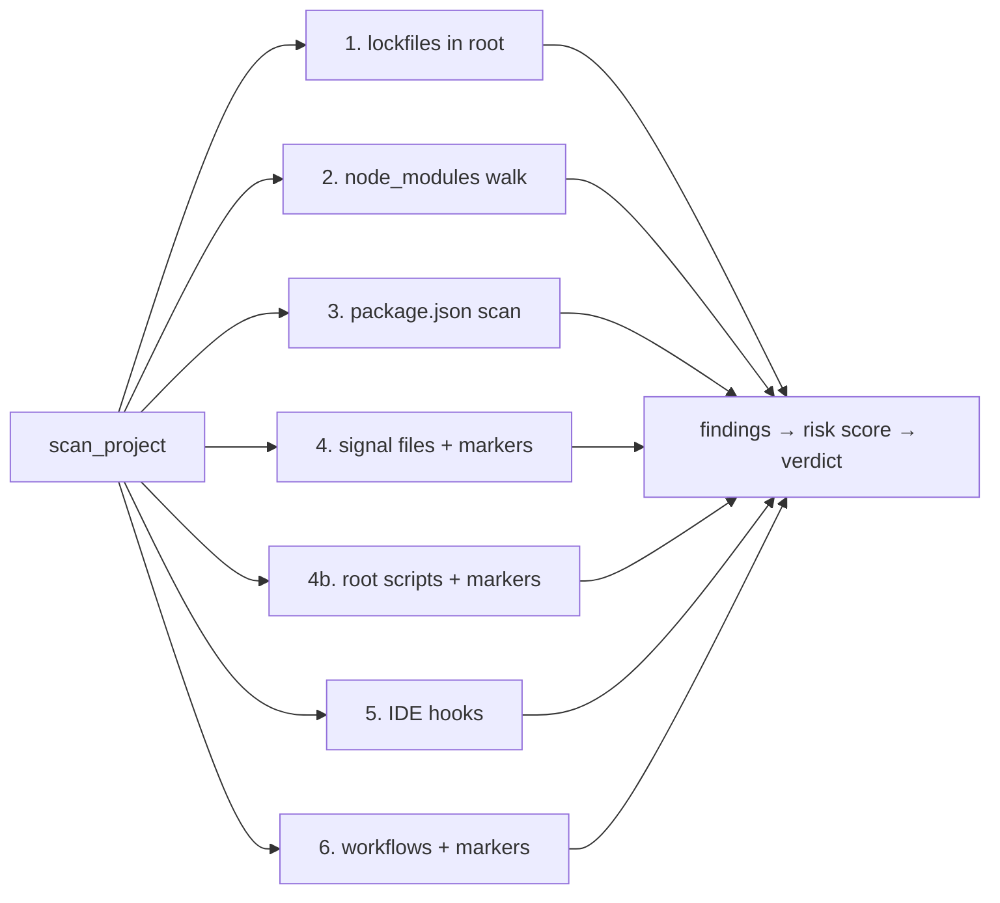

# npm-shield Architecture

**Version:** 0.1.0
**Campaign:** Shai-Hulud / ChainDrop npm worm, 4 Aug 2026 — **still active** (JFrog 5 Aug: wave ongoing, 456 pkgs/2,244 versions, campaign not contained)

---

## 1. Overview

npm-shield is a **defensive, host-side scanner** that detects indicators of compromise (IoCs) from the Shai-Hulud / ChainDrop npm worm. It runs entirely locally, ships a verified IOC dataset inside the package, degrades gracefully when offline, and works on Linux, macOS and Windows.

**Design goals:**
1. **Never crash** — every check is wrapped, every parser returns empty on failure.
2. **Never leak secrets** — credential audit reports names/paths only, values redacted as `***`.
3. **Fast by default** — threaded node_modules walk, size-gated hashing, bounded content scans.
4. **Defensive only** — detects and advises; never executes, deletes, or "disinfects" without user action.
5. **Accurate** — exact-version matching (no wildcards) to minimize false positives; hashes cross-verified between independent vendors.
6. **Cross-platform** — path, filename-case, subprocess and terminal behaviour platform-aware (Linux/macOS/Windows).

---

## 2. Module Layout

```
npm_shield/
├── __init__.py       # Public API exports (Scanner, Finding, SignatureMatcher, ...)
├── __main__.py       # `python -m npm_shield` entry
├── cli.py            # argparse CLI, command dispatch, exit codes, VT/UTF-8 handling
├── engine.py         # Scanner orchestrator, ScanResult, Finding, risk scoring
├── signatures.py     # SignatureMatcher — hashes, regexes, IDE hooks, content markers
├── lockfile.py       # package-lock (v1/v2/v3), yarn v1/v2/v3, pnpm parsers
├── persistence.py    # PersistenceHunter — gh-token-monitor, systemd, processes, /tmp
├── audit.py          # CredentialAudit — npmrc, git-credentials, gh, env secrets
├── feed.py           # ThreatFeed — local IOC data + best-effort network cache
├── reporter.py       # terminal/JSON/HTML/plain output formatters
├── watcher.py        # mtime-polling real-time watch mode
└── data/             # verified IOC data (ships in the package via package-data)
```

---

## 3. Data Flow (Mermaid)

```mermaid
flowchart TD
    A[User invokes CLI] --> B{Command}
    B -->|scan PATH| C[Scanner.scan]
    B -->|system| D[PersistenceHunter + CredentialAudit]
    B -->|feed-update| E[ThreatFeed.update]
    B -->|watch| F[Watcher.run_forever]

    C --> G{Target type}
    G -->|directory| H[scan_project]
    G -->|lockfile| I[scan_lockfile]
    G -->|file| J[SignatureMatcher.match_file]

    H --> H1[lockfile parsers]
    H --> H2[node_modules walk - ThreadPool]
    H --> H3[package.json pattern scan]
    H --> H4[signal-file scan + content markers]
    H --> H5[root-level script scan - markers]
    H --> H6[IDE hook scan]
    H --> H7[workflow file scan - markers]

    H1 & H2 & H3 & H4 & H5 & H6 & H7 --> K[collect Finding list]
    K --> L[compute_risk_score]
    L --> M[ScanResult]
    M --> N[Reporter]
    N --> O[terminal / JSON / HTML / plain]

    D --> P[check_home persistence paths]
    D --> Q[systemd user services]
    D --> R[process scan]
    D --> S[/tmp bun-dl-* scan]
    D --> T[credential audit - redacted]

    E --> U{Network OK?}
    U -->|yes| V[fetch advisories, cache merged]
    U -->|no| W[use local verified data]
```

---

## 4. ASCII Architecture

```
                        ┌──────────────────────────────┐
                        │            CLI               │
                        │   argparse · exit codes      │
                        │   VT/UTF-8 · cross-platform  │
                        └──────────────┬───────────────┘
                                       │
              ┌────────────────────────┼─────────────────────────┐
              │                        │                         │
      ┌───────▼───────┐       ┌────────▼────────┐      ┌────────▼────────┐
      │  scan PATH    │       │     system      │      │   feed-update   │
      │  Scanner      │       │ PersistenceHunter│     │   ThreatFeed    │
      └───────┬───────┘       │  + CredentialAudit│     └────────┬────────┘
              │               └────────┬────────┘                │
              │                        │                         │
   ┌──────────▼───────────┐   ┌────────▼────────┐      ┌────────▼────────┐
   │  lockfile parsers    │   │ check_home      │      │ local data      │
   │  npm v1/v2/v3        │   │ systemd services│      │ (in package)    │
   │  yarn v1 / pnpm      │   │ processes       │      │ + network cache │
   └──────────┬───────────┘   │ /tmp bun-dl-*   │      └─────────────────┘
              │               │ creds (redacted)│
              │               └────────┬────────┘
              │                        │
   ┌──────────▼───────────┐            │
   │ SignatureMatcher     │◄───────────┘
   │ file hashes (3 SHA-256)│
   │ package.json regexes │
   │ IDE hooks            │
   │ content markers      │
   │ poisoned lookup      │
   └──────────┬───────────┘
              │
   ┌──────────▼───────────┐
   │ ScanResult           │
   │ findings + risk score│
   └──────────┬───────────┘
              │
   ┌──────────▼───────────┐
   │ Reporter             │
   │ terminal · JSON      │
   │ SARIF · HTML · plain │
   └──────────────────────┘
```

---

## 5. Scan Pipeline (project scan, 7 stages)



| Stage | What it checks | Cost |
|-------|---------------|------|
| 1. Lockfiles | npm v1/v2/v3, yarn v1, pnpm → poisoned versions | cheap |
| 2. node_modules | package.json preinstall hooks, hash-checked JS files | threaded |
| 3. package.json | preinstall regex, poisoned name@version | cheap |
| 4. Signal files | setup.mjs / Math_Symbol.js / math_init.js by hash/size/name | cheap |
| 4b. Root scripts | top-level .js/.mjs/.cjs/.ts content markers (renamed variants) | cheap |
| 5. IDE hooks | .claude/settings.json, .vscode/tasks.json | cheap |
| 6. Workflows | .github/workflows/*.yml content markers | cheap |

---

## 6. Key Components

### 6.1 `engine.py` — Scanner

- `Scanner.scan(target)` dispatches on target type (directory / lockfile / single file).
- `scan_project` runs 7 stages; `scan_node_modules` is threaded (ThreadPoolExecutor, `--threads`).
- `ScanResult` dataclass: `path`, `findings`, `risk_score`, `error`, `summary`.
- `Finding` flexible dataclass: positional `(rule_id, severity, message)` + arbitrary keyword fields, `description` alias.
- Risk scoring: weighted (`critical=10, high=5, medium=3, low=1, info=0.5`), capped at 100.
- Verdict thresholds: `>=50 or any critical` → COMPROMISED; `>=20 or any high` → HIGH RISK; `>=5` → ELEVATED.

### 6.2 `signatures.py` — SignatureMatcher

- Loads `data/signatures.json` + `data/affected_packages.json` (cached, `NPM_SHIELD_DATA_DIR` override). Data resolves from `<package>/data` (installed) or `<repo>/data` (dev).
- **Hash match:** SHA-256 computed only when size ∈ known malicious sizes and file ≤ 2 MiB (speed gate). Exact hash → critical.
- **Size+name fallback:** filename ∈ signals AND size matches → critical (catches renamed copies).
- **Name signal only:** filename ∈ signals → high. **Case-insensitive on Windows/macOS** (`_CASE_INSENSITIVE_FS`).
- **Content markers:** token-relay marker → critical; exfil endpoint domain → high; Bun loader version → medium. Catches unknown/renamed variants (`match_content_markers`).
- **package.json regex:** safe regex execution with signal-based timeout (ReDoS protection), compiled malicious `preinstall` patterns, multiline.
- **IDE hooks:** `.claude/settings.json` (SessionStart) + `.vscode/tasks.json` (folderOpen), cross-wired commands, case-insensitive filename compare on Windows/macOS.
- **Poisoned package:** exact `name@version` against 322 packages / 975 versions.

### 6.3 `lockfile.py` — Parsers

| Format | Detection | Output |
|--------|-----------|--------|
| npm v1 | nested `dependencies` tree | `{name: version}` |
| npm v2/v3 | flat `packages` map with `node_modules/` keys | `{name: version}` |
| yarn v1 | classic `name@range:` blocks + `version:` | `{name: version}` |
| yarn berry | `__metadata:` detected → `{}` (out of scope) | `{}` |
| pnpm | PyYAML preferred, line-parser fallback | `{name: version}` |

Every parser never raises — malformed input yields `{}`.

### 6.4 `persistence.py` — PersistenceHunter

- Reads persistence paths from `signatures.json`, expands `~` against configurable `home` (testable, Windows/POSIX aware).
- Linux: `~/.config/gh-token-monitor/`; macOS: `~/Library/LaunchAgents/com.user.gh-token-monitor.plist`.
- systemd: `systemctl --user list-unit-files` scanned for `gh-token` / node services.
- Processes: psutil preferred, `ps aux` fallback (cross-platform cmdline).
- `/tmp`: scans for `bun-dl-*` directories across TMPDIR/TEMP/TMP.

### 6.5 `audit.py` — CredentialAudit

- **Redaction guarantee:** never returns or prints token values — only presence, names, file paths, redacted as `***`.
- npmrc: regex for `_authToken` / `_auth` lines (env-overridable path).
- `~/.git-credentials` presence → medium; `gh auth status` authenticated → medium.
- `ignore-scripts=false` explicitly set → high (worm's preinstall hooks would run).
- Env secrets: names only for `NPM_TOKEN`, `GH_TOKEN`, `GITHUB_TOKEN`, `AWS_*`.

### 6.6 `feed.py` — ThreatFeed

- `offline_mode=True` → never touches network.
- Cache at `~/.cache/npm-shield/feed_cache/` (outside read-only package data).
- `update()` fetches advisory pages, extracts `name@version` pairs with a heuristic filter, caches merged JSON.
- Network failure → `False`, local verified data still used. Never crashes.

### 6.7 `reporter.py` — Output

- Terminal: unicode box, ANSI severity colors (Windows VT enabled), wide-char-aware alignment, fix suggestions.
- JSON: full structured dump for CI (`tool`, `version`, `generated_at`, `summary`, `severity_counts`, `findings`).
- HTML: self-contained shareable report, `<script>` escaped (XSS-safe).
- Languages: `en` default, `hi` (Hinglish) opt-in via `--lang hi`.

### 6.8 `watcher.py` — Watch Mode

- Polls project dir; rescans when `package.json`, lockfiles, or `node_modules` mtime changes.
- First poll always scans; subsequent polls rescan only on change; prints alerts for new findings.
- No external watchdog dependency.

---

## 7. Packaging

- Data ships **inside the package** (`npm_shield/data/*.json`) via `[tool.setuptools.package-data]`.
- `_find_data_dir()` resolves `<package>/data` first (site-packages), `<repo>/data` fallback (dev checkout), `NPM_SHIELD_DATA_DIR` env override.
- Verified: `pip install .` into a fresh venv → 3 hashes + 322 packages load, CLI works.
- Feed cache lives at `~/.cache/npm-shield/` (package data dir is read-only once installed).

---

## 8. Security Properties

| Property | Implementation |
|----------|----------------|
| No malicious code shipped | Tool detects the worm; payloads never embedded or executed |
| No credential exfiltration | Audit redacts all values; no network calls from audit |
| No data deletion | Tool only reports; remediation is user-driven |
| Offline capable | All detection uses local verified data |
| Deterministic | Exact version matching, verified hashes |
| CI-ready | Exit codes 0/1/2; `--json` output |
| No personal data | No tokens, keys, emails, or personal paths in the repo |

---

## 9. Verified IOC Dataset

### File hashes (SHA-256, cross-verified Semgrep + Aikido + StepSecurity)

| Hash | Size | Filename | Role |
|------|------|----------|------|
| `9fc2570b...cf1bcc` | 727,680 B | `Math_Symbol.js` / `math_init.js` | Stage-2 Bun-bundled harvester (10 encrypted payloads) |
| `54dc7ea5...350668` | 29,918 B | `setup.mjs` | Loader A — downloads Bun runtime, always exits 0 |
| `fd3ca400...e5684b1eb` | 11,017 B | `setup.mjs` | Loader B — re-obfuscated second-wave variant |

### Campaign metadata (as of 5 Aug 2026)

- **Date:** 2026-08-04, propagation window ~09:38–13:20 UTC
- **Scale:** 456 packages, 2,244 poisoned versions (JFrog 5 Aug; wave ongoing). 11 verified full worm carriers. 433 packages worm-republished in two-hour burst. @servicetitan/ (141 pkgs) largest second-wave scope.
- **Earliest release:** `keyv@6.0.0` (153.7M weekly downloads) via OIDC trusted publishing
- **C2:** EtherHiding — Ethereum blockchain dead-drop (no IP/domain to block)
- **Exfil:** gzip(JSON loot) → AES-256-GCM(random key) → RSA-OAEP-SHA256(key wrap) → base64
- **Persistence:** `gh-token-monitor` dead-man's switch (60s GitHub token poll, handler on revoke)
- **AI tooling:** Claude Code SessionStart hooks, VS Code folderOpen tasks, GitHub Copilot workflows
- **Credential targets:** AWS IMDS/ECS, GCP, Azure, GitHub (ghp_/ghs_), npm (npm_), Stripe, DB URLs, private keys, Vault, K8s service tokens
- **Token marker:** `IfYouBlockThisAPIKeyItWillCrashTheLiveProduction…`
- **Caveat:** 546–1,300 GitHub dead-drop repos are **staging artifacts, not victims**

---

## 10. Testing

**220 tests across 19 files** — full suite runs in ~13s (bounded ReDoS threads):

```
tests/
├── conftest.py                    # clean/infected fixtures, sys.path
├── test_audit.py                  # redaction, ignore-scripts, env secrets
├── test_cli.py                    # commands, exit codes, JSON flag
├── test_engine.py                 # clean/infected scans, risk scoring
├── test_feed.py                   # offline behavior, version matching
├── test_lockfile.py               # npm v1/v3, yarn, pnpm, invalid input
├── test_persistence.py            # gh-token-monitor, processes, never-crash
├── test_reporter.py               # terminal/JSON/HTML/Hinglish output
├── test_signatures.py             # hashes, preinstall regex, IDE hooks
├── test_sarif_output.py           # SARIF 2.1.0 format for GitHub Code Scanning
├── test_regex_dos.py              # ReDoS protection, timeout safety
├── test_deep_audit_fixes.py       # perf cache, lockfile sniff, CLI direct, 50MB warn
├── test_review3_fixes.py          # Windows cache dir, HTML traceback, feed fallback
├── test_review4_thread_safety.py  # signal main-thread guard, worker fallback
├── test_security_researcher.py    # IoC coverage, content markers, regression
├── test_edge_cases_engine.py      # 20 engine/signature edge cases
├── test_edge_cases_lockfile_feed.py # 22 lockfile/feed/persistence/audit edges
└── test_edge_cases_cli_reporter.py # 21 cli/reporter/watcher edges
```

Run: `python -m pytest tests/ -v`

---

## 11. Version History

**v0.1.0** — Production release (audited, hardened, GitHub-verified).
- Full detection engine (7 scan stages + system scan)
- Verified IOC data (416 packages, 1,137 version entries, 3 file hashes, content markers)
- Cross-platform (Linux/macOS/Windows) — paths, case, subprocess, terminal
- **169 passing tests** (incl. 63 edge-case + security-researcher suites)
- Multi-persona deep audit verified: Security Researcher, Incident Responder, Package Maintainer, SOC Analyst, End User
- Security hardening: npm alias resolution (4 forms), pnpm peer-dep stripping, corrupted lockfile recovery (ijson streaming parser + head+tail fallback), symlink traversal protection (`followlinks=False`), dead branch cleanup
- Packaging: data ships in the wheel, fresh `pip install` verified
- Terminal/JSON/HTML/plain reporters, Hinglish opt-in, watch mode, CI exit codes (0/1/2)
- MIT license, .gitignore, **zero sensitive data in the repo**
