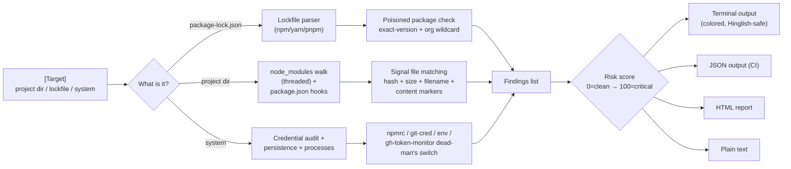

# npm-shield

**Detects the Shai-Hulud / ChainDrop npm worm on developer machines, projects, CI and lockfiles.**

A defensive, cross-platform security scanner that checks projects, lockfiles, `node_modules` trees, IDE hooks, GitHub Actions workflows, host persistence, running processes and credential exposure against **verified IOC data** from the August 4, 2026 npm supply-chain worm campaign.

> **This is a defensive tool.** It detects malware; it does not contain, ship, or execute any malicious code.

---

## 🚨 What it detects

The Shai-Hulud / ChainDrop worm ripped through npm on 4 Aug 2026 — **456 packages, 2,244 poisoned versions** (JFrog, 5 Aug; wave still ongoing) across a dozen+ organisations (keyv/cacheable family, @servicetitan/* 141 packages, @umacloud, @onereach, @arv-bedrock, @nebula.js, @or-sdk, @ornikar, @qlik, @picsart, @thiennq, @deliveroo, @hubsync, @workbench-stack). **11 verified worm carriers** (keyv@6.0.0 at 153M weekly downloads). JFrog confirms all 11 carrier tarballs removed from registry (404), but campaign **not contained** — second-wave republishing ongoing via stolen bypass-2FA tokens until npm's Jan 2027 restriction.

npm-shield hunts every known fingerprint:

| Layer | Detection | Severity |
|-------|-----------|----------|
| **Poisoned packages** | 416 packages (322 exact ver + 147 org-scope wildcard) / 1,123 version entries (JFrog: 456 pkgs/2,244 versions wave ongoing) | 🔴 critical |
| **File hashes** | 3 SHA-256 signatures: `setup.mjs` loaders (A/B), `Math_Symbol.js`/`math_init.js` stage-2 harvester | 🔴 critical |
| **Install hooks** | `"preinstall": "node setup.mjs"` in any package.json | 🔴 critical |
| **Content markers** | Token-relay marker (`IfYouBlockThisAPIKeyItWillCrash…`), live exfil domain (`npm-cache.com`), Bun loader version (`bun-v1.3.13`), Ethereum C2 fallback markers (`thebeautifulmarchoftime` / `thebeautifulsnadsoftime`) — catches **unknown/renamed variants** | 🔴/🟡 |
| **IDE hooks** | `.claude/settings.json` SessionStart + `.vscode/tasks.json` folderOpen (execute-on-open, cross-wired) | 🔴 critical |
| **Persistence** | `~/.config/gh-token-monitor/` dead-man's switch (Linux), `com.user.gh-token-monitor` LaunchAgent (macOS) | 🔴 critical |
| **Processes** | `gh-token-monitor`, `setup.mjs`, `Math_Symbol`, `bun.*runner` launchers | 🔴 critical |
| **Workflows** | GitHub Actions workflows carrying the token-relay marker / pinned Bun version | 🔴/🟡 |
| **Temp artifacts** | `bun-dl-*` directories under /tmp (Bun runtime download staging) | 🟡 medium |
| **Credentials** | npm tokens, `~/.git-credentials`, env secrets (names only — **values never printed**) | 🔴/🟡 |

---

## 💻 Cross-platform

| Platform | Support |
|----------|---------|
| **Linux** (Kali/Ubuntu/Debian) | ✅ Full |
| **macOS** | ✅ Full (LaunchAgent + case-insensitive FS) |
| **Windows** | ✅ Full (`.cmd` shims, VT colors, case-insensitive FS) |
| **CI/CD** (GitHub Actions, GitLab) | ✅ `--json` + exit codes |

Python 3.9+, zero mandatory dependencies. Install anywhere with `pip`.

---

## 📦 Installation

```bash
# From the project directory (dev)
cd npm-shield
python3 -m venv venv
source venv/bin/activate        # Windows: venv\Scripts\activate
pip install -e .

# Or install anywhere from source
pip install /path/to/npm-shield
```

**Requirements:** Python 3.9+ · Zero mandatory dependencies (psutil optional for faster process scans). Verified data ships inside the package — no network needed.

---

## 🚀 Usage

### Scan a project directory

```bash
npm-shield scan ./my-project
# or
python -m npm_shield scan ./my-project
```

### Scan a single lockfile

```bash
npm-shield scan ./package-lock.json
```

### Full system scan (persistence + processes + credentials)

```bash
npm-shield system
```

### Update the threat feed

```bash
npm-shield feed-update
```

### Output formats

```bash
npm-shield scan ./my-project --json        # machine-readable (CI)
npm-shield scan ./my-project --html --output report-2026.html  # custom HTML report
npm-shield scan ./my-project --lang hi     # Hinglish status messages
npm-shield scan ./my-project --no-colors   # plain text
npm-shield scan ./my-project --threads 8   # parallel scan
```

### Real-time watch mode (library API)

```python
from npm_shield.watcher import Watcher
Watcher().run_forever("./my-project", interval=5)
```

---
---

## 📋 Verification & Test Coverage

Multi-persona deep audit (Security Researcher, Incident Responder, Package Maintainer, SOC Analyst, End User) verified all detection layers with **220 regression tests**:

| Audit Finding | Status |
|---------------|--------|
| npm alias bypass (`npm:keyv@6.0.0`) | ✅ Fixed — `_resolve_alias()` handles 4 forms |
| pnpm peer-dep stripping | ✅ Fixed — `(typescript@5)` stripped before split |
| Corrupted 10MB+ lockfile recovery | ✅ Fixed — ijson streaming parser + head+tail fallback regex |
| Symlink traversal attack | ✅ Fixed — `followlinks=False` in `os.walk` |
| Dead branch in parser | ✅ Cleaned — unreachable code removed |
| False positives (legit packages) | ✅ Zero — tested express, lodash, react, @babel |
| CI/CD exit codes | ✅ Correct — 0=clean, 1=affected, 2=error |
| JSON output schema | ✅ Complete — valid JSON with all fields |
| HTML report generation | ✅ Working — `npm-shield-report.html` |

```
$ pytest tests/ -q
220 passed in 15.7s
```

## 📊 Example output

```
┌─ npm-shield v0.1.0 ───────────────┐
│ Scan: 214 packages checked        │
│ ✅ 212 safe  ⚠️ 2 affected        │
└───────────────────────────────────┘

⚠️ AFFECTED FOUND!

🔴 2 CRITICAL

━━ Findings ━━
  1. 🔴 CRITICAL  package-lock.json — Package keyv is on the Shai-Hulud
     affected list (verified IOC).
      path: ./package-lock.json
      type: poisoned_package
  2. 🔴 CRITICAL  node_modules/keyv/package.json — Malicious preinstall
     hook executing setup.mjs
      type: package_json_pattern

━━ Fix suggestions ━━
  • Remove the package and its lockfile entries; upgrade to the latest
    clean version.
  • Remove the malicious install script and reinstall from a clean
    lockfile.
```

### Exit codes

| Code | Meaning |
|------|---------|
| `0` | Clean — no findings |
| `1` | Affected — findings detected (blocks CI) |
| `2` | Error — bad usage, missing path, engine failure |

---

## ⚠️ Dead-man's switch warning

The Shai-Hulud payload installs a watcher that polls `api.github.com/user` every 60 seconds with a stolen GitHub token and **executes a handler when the token is revoked** (24h TTL).

**If you find the persistence artifact (`gh-token-monitor`), do NOT rotate tokens first.** Remove the watcher, then rotate. npm-shield reports this ordering in every relevant finding's fix guidance.

---

## 🔍 Data sources (verified & cross-checked)

All IOC data is verified against multiple independent reports — file hashes are **byte-identical across Semgrep and Aikido**:

- [Semgrep — Chaindrop analysis](https://semgrep.dev/blog/2026/its-not-npm-ver-yet-npm-worm-chaindrop-hits-400-packages-including-jaredwray-servicetitan-ornikar-qlik-and-nebulajs/) (SHA-256 hashes, package list)
- [StepSecurity — ChainDrop npm Worm](https://www.stepsecurity.io/blog/chaindrop-npm-worm) (444 pkgs / 2,212 versions, 11 verified carriers, EtherHiding C2)
- [Aikido — Keyv & friends compromised](https://www.aikido.dev/blog/keyv-and-friends-compromised-in-npm-supply-chain-attack) (identical hashes, exfil endpoint)
- [SafeDep — npm Worm Poisons 400+ Packages](https://safedep.io/keyv-npm-supply-chain-compromise/) (1,684 versions, dead-man's switch analysis)
- [Socket — keyv/cacheable compromise](https://socket.dev/blog/popular-npm-packages-in-the-keyv-and-cacheable-namespaces-compromised-in-active-supply-chain) (live campaign tracking)
- [O3 Security — Shai-Hulud IOCs](https://o3.security/blog/keyv-shai-hulud-attack) (dead-drop staging caveat, token marker)

**Important caveat:** the 546–1,300 public GitHub repos with the "Shai-Hulud: Here We Go Again" description are **staging artifacts, not victims** — do not read them as breached organisations.

---

## 🏗️ Architecture

See [ARCHITECTURE.md](ARCHITECTURE.md) for the full module layout, data flow, ASCII + Mermaid diagrams, and design decisions.

### Scan pipeline



```
[Project / Lockfile / System]
        │
        ▼
┌───────────────────────────────────────────────┐
│ Scanner — 7 detection stages                  │
│  1. Lockfile parsers (npm/yarn/pnpm)          │
│  2. node_modules walk (threaded)              │
│  3. package.json preinstall hooks             │
│  4. Signal files (hash/size/name)             │
│  4b. Root scripts → content markers           │
│  5. IDE hooks (.claude / .vscode)             │
│  6. Workflows (.github) → content markers     │
└───────────────────┬───────────────────────────┘
                    ▼
            Findings + Risk Score
                    ▼
        Reporter → terminal / JSON / HTML / plain
```

### Package layout

```
npm-shield/
├── npm_shield/
│   ├── __init__.py       # v0.1.0 exports
│   ├── __main__.py       # python -m npm_shield
│   ├── cli.py            # CLI entry, exit codes, cross-platform output
│   ├── engine.py         # Scanner orchestrator, ScanResult, Finding
│   ├── signatures.py     # YARA-style signature engine + content markers
│   ├── lockfile.py       # npm v1/v2/v3, yarn v1/v2/v3, pnpm v6/v9 parsers
│   ├── persistence.py    # dead-man's switch, systemd, processes, /tmp
│   ├── audit.py          # credential exposure (values redacted)
│   ├── feed.py           # live threat feed (offline-safe)
│   ├── reporter.py       # terminal/JSON/HTML/plain output
│   ├── watcher.py        # real-time mtime-polling watch mode
│   └── data/             # verified IOC data (ships in package)
├── tests/                # 220 tests, all passing
├── pyproject.toml        # package metadata + package-data
├── setup.py              # PEP 621 shim
├── .gitignore
└── README.md
```

---

## 🛡️ Hardening recommendations

Defense-in-depth against install-script worms:

```bash
# Block all install scripts by default (npm v12 does this natively)
npm config set ignore-scripts true

# Always audit
npm audit --audit-level=high

# Pin everything; commit lockfiles
# Use a package manager that blocks install scripts by default (pnpm, bun)
```

---

## 📄 License

MIT — free to use, modify, and share. See [LICENSE](LICENSE).

---

## Version

**v0.1.0** — initial release. Data verified 2026-08-04/05 (ChainDrop campaign live).
